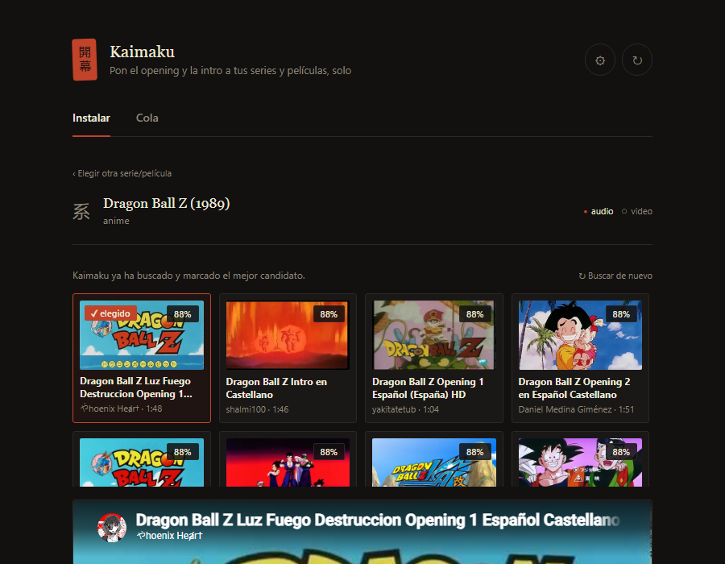

# 開幕 Kaimaku

Instala automáticamente los openings/temas (`theme-music/song1.mp3` y `backdrops/intro.mp4`) de tus series y películas en Jellyfin/Emby, buscándolos en YouTube y priorizando fuentes oficiales en español/castellano/latino. Corre en segundo plano: escanea tu biblioteca cada pocas horas, instala sola lo que encuentra con confianza suficiente, y te deja el resto marcado como "revisión" en un panel con pósters reales — sin que tengas que abrirlo cada vez.

[](https://hub.docker.com/r/nemesbak/kaimaku)
[](https://hub.docker.com/r/nemesbak/kaimaku)

[](LICENSE)


Tres formas de instalarlo, elige la que uses para gestionar tus contenedores: [Docker Compose](#instalar) (cualquier sistema), [Portainer](#-instalar-con-portainer-stack-desde-git) (stack sincronizado desde Git) o [Unraid](#-instalar-en-unraid-plantilla) (plantilla lista para Community Applications).



## Instalar

Instalar Kaimaku es literalmente: pegar 3 comandos y cambiar **una sola línea** (la ruta de tu biblioteca). No hay que crear cuentas, ni tocar bases de datos, ni instalar nada más aparte de Docker. Si te equivocas de ruta no pasa nada grave: Kaimaku simplemente no encontrará ninguna serie, y te lo dirá con un aviso claro en la propia web (botón **⚙ Diagnóstico**) para que la corrijas.

Requisito único: Docker + Docker Compose v2 (`docker compose`, no `docker-compose`). La imagen ya está publicada en [Docker Hub](https://hub.docker.com/r/nemesbak/kaimaku) para `amd64` y `arm64` (funciona también en Raspberry Pi, Synology, etc.) — no hace falta compilar nada.

**Paso 1 — Clona el repositorio**

```bash
git clone https://github.com/nemesbak/kaimaku.git
cd kaimaku/docker-app
```

**Paso 2 — Edita `docker-app/docker-compose.yml`**

Este es el archivo completo, tal cual viene en el repo — no hay ningún `.env` aparte, todo está aquí:

```yaml
services:
  kaimaku:
    image: nemesbak/kaimaku:latest
    container_name: kaimaku
    ports:
      - "8098:8098"   # <-- puerto donde abrirás Kaimaku: http://IP-DEL-SERVIDOR:8098
    environment:
      # No hace falta tocar nada aquí: Kaimaku detecta solo cada subcarpeta que
      # encuentre dentro de /media (anime/, series/, peliculas/... con el
      # nombre que sea) y la trata como una biblioteca. Solo rellena
      # MEDIA_ROOTS si quieres limitarlo a carpetas concretas (separadas por
      # comas, rutas DENTRO del contenedor, ej: "/media/anime,/media/series").
      MEDIA_ROOTS: ""
      DATA_DIR: "/data"
      # Jellyfin/Emby son opcionales: sin API key, todo funciona igual pero se
      # omiten los pósters y el refresco automático de biblioteca tras
      # instalar. host.docker.internal apunta al propio host Docker (sirve si
      # Jellyfin/Emby corren en el mismo host o como contenedores normales, no
      # en otra máquina de tu red — en ese caso pon su IP real). API key:
      # Panel de control de Jellyfin/Emby → Avanzado → API Keys → Nueva clave.
      JELLYFIN_URL: "http://host.docker.internal:8096"
      JELLYFIN_API_KEY: ""
      EMBY_URL: "http://host.docker.internal:8097"
      EMBY_API_KEY: ""
      # Kaimaku escanea la biblioteca solo cada X horas: instala directamente
      # lo que encuentre con confianza suficiente (AUTO_MIN_SCORE) y deja el
      # resto marcado como "revisión" en la propia web para que elijas tú.
      AUTO_SCAN_INTERVAL_HOURS: "12"
      AUTO_MIN_SCORE: "0.75"
      AUTO_ASSETS: "audio,video"
      # Opcional: aviso por Telegram con el resumen de cada escaneo
      # automático (solo si instaló algo, dejó algo a revisión o falló algo —
      # nunca si no había nada que hacer). Vacío = desactivado.
      TG_BOT_TOKEN: ""
      TG_CHAT_ID: ""
      TG_TOPIC_ID: ""
    extra_hosts:
      - "host.docker.internal:host-gateway"
    volumes:
      # <-- CAMBIA ESTA (es el ÚNICO cambio necesario para instalar Kaimaku):
      # la ruta REAL de tu biblioteca en el host, la carpeta que POR DENTRO
      # contiene anime/, series/, peliculas/... (los nombres que sean, no hace
      # falta que coincidan con nada). Ejemplos según dónde corra esto:
      #   Unraid:   /mnt/user/datos/media
      #   Synology: /volume1/media
      #   TrueNAS:  /mnt/pool/media
      #   Linux:    /home/usuario/media
      # ¿Dudas de cuál es? Entra por SSH/terminal y ejecuta `ls RUTA`: si ahí ves
      # tus carpetas anime/series/peliculas, es la correcta. Si te equivocas, la
      # propia app te avisará al abrirla (botón "⚙ Diagnóstico").
      - /mnt/user/datos/media:/media
      # Carpeta pequeña para el estado (qué está instalado, qué queda a
      # revisión), backups y descargas en curso. No hace falta tocarla.
      - ./data:/data
    restart: unless-stopped
    # Jobs en curso viven en memoria; en el apagado se espera hasta 25s a que
    # termine una descarga activa antes de salir. Mantén esto por encima.
    stop_grace_period: 30s
```

Lo único que **tienes** que cambiar es la línea marcada `<-- CAMBIA ESTA`, por la ruta real de tu biblioteca. Todo lo demás (`MEDIA_ROOTS`, el puerto, Jellyfin/Emby, el escaneo automático) ya viene con valores que funcionan tal cual — ajústalos solo si quieres algo distinto.

<details>
<summary>¿No sabes cuál es la ruta real de tu biblioteca?</summary>

Tu servidor (NAS, servidor Linux, Unraid...) tiene una carpeta real donde viven tus series/películas. Docker no la ve a menos que se la "prestes" (eso es la línea del volumen de arriba). Rutas típicas según dónde corras esto:

| Sistema | Ruta típica |
| --- | --- |
| Unraid | `/mnt/user/datos/media` |
| Synology | `/volume1/media` |
| TrueNAS | `/mnt/pool/media` |
| Linux genérico | `/home/usuario/media` |

Si no estás seguro: entra por SSH (o la terminal de tu NAS) y navega hasta la carpeta que contiene tus subcarpetas `anime/`, `series/`, `peliculas/`... esa es, no importa cómo se llamen ni cuántas tengas.

</details>

**Paso 3 — Levanta el contenedor**

```bash
docker compose up -d
```

**Paso 4 — Abre la app y listo**

```text
http://IP-DEL-SERVIDOR:8098
```

Verás tus series y películas como una parrilla de pósters (si tienes Jellyfin/Emby configurados, tira de sus imágenes reales). No hace falta que hagas nada más: en segundo plano, Kaimaku ya está escaneando la biblioteca y empezará a instalar temas solo. Si quieres forzarlo ya, pulsa **Escanear ahora** arriba.

Si al abrirlo no ves ninguna serie o película, no te preocupes: pulsa el botón **⚙** de la esquina superior derecha — te dirá exactamente qué carpeta no ha encontrado y qué línea del `docker-compose.yml` revisar (ver [Diagnóstico integrado](#-diagnóstico-integrado) más abajo).

## 🐳 Instalar con Portainer (stack desde Git)

Si gestionas tus contenedores con Portainer, no hace falta pegar el `docker-compose.yml` a mano: Portainer puede desplegar el stack directamente desde este repositorio de GitHub y volver a sincronizarlo cada vez que cambie.

1. **Stacks → Add stack.**
2. Ponle un nombre (ej. `kaimaku`) y en **Build method** elige **Repository**.
3. **Repository URL:** `https://github.com/nemesbak/kaimaku.git` · **Reference:** `refs/heads/main`.
4. **Compose path:** `docker-app/docker-compose.yml`.
5. (Opcional) Activa **GitOps updates** con un intervalo (ej. cada 5 minutos) para que Portainer vuelva a desplegar solo si el `docker-compose.yml` del repo cambia en el futuro.
6. Pulsa **Deploy the stack**.

Antes de desplegar, edita en el propio formulario de Portainer la línea del volumen `- /mnt/user/datos/media:/media` para poner tu ruta real (es el mismo único cambio necesario que en la instalación por Compose de más arriba).

## 🖥️ Instalar en Unraid (plantilla)

Kaimaku trae una plantilla lista para el **Add Container** de Unraid — rellena puertos, rutas y variables solo, sin depender del catálogo público de Community Applications.

1. Ve a la pestaña **Docker** de Unraid y pulsa **Add Container**.
2. En el campo **Template** (parte inferior del formulario) pega esta URL:
   ```text
   https://raw.githubusercontent.com/nemesbak/kaimaku/main/unraid-template/kaimaku.xml
   ```
3. El formulario se rellena solo (puerto `8098`, carpetas `/media` y `/data`, variables de Jellyfin/Emby, escaneo automático). Cambia únicamente el campo **Media** por la ruta real de tu biblioteca (ej. `/mnt/user/datos/media`).
4. Pulsa **Apply**.

> Nota: esto instala Kaimaku directamente desde su propia plantilla, sin necesidad de que aparezca en el buscador de Community Applications (eso requeriría enviarla y que la aprobasen en el repositorio de plantillas de la comunidad de Unraid — un trámite aparte y externo a este proyecto).

## Estructura de carpetas esperada

Kaimaku instala los archivos con el mismo esquema que ya usan Jellyfin/Emby para temas e intros, dentro de la carpeta de cada serie o película:

```text
media/
├── anime/                         <- una biblioteca, detectada sola
│   └── Nombre de la serie/
│       ├── theme-music/
│       │   └── song1.mp3          <- audio del opening/tema, lo crea Kaimaku
│       ├── backdrops/
│       │   └── intro.mp4          <- video del opening/tema, lo crea Kaimaku
│       └── Temporada 1/...        <- tus episodios, Kaimaku no los toca
├── series/
└── peliculas/
```

No hace falta crear `theme-music/` ni `backdrops/` a mano: Kaimaku los crea solos al instalar. Si ya existía un archivo con ese nombre, se guarda una copia de seguridad antes de sobrescribirlo (ver `data/backups/` dentro de la carpeta del proyecto).

Recuerda activar la reproducción en cada cliente: en Jellyfin/Emby, **Ajustes → Pantalla → Bibliotecas → Reproducir temas/vídeos de fondo**. Cuando una serie tiene ambos, el vídeo tiene prioridad sobre el audio.

## Cómo funciona

Kaimaku hace dos cosas a la vez, y no necesitas elegir entre ellas:

**En segundo plano (lo que hace que no tengas que tocar nada):** cada `AUTO_SCAN_INTERVAL_HOURS` horas (12 por defecto), Kaimaku recorre toda tu biblioteca. Para cada serie o película sin tema/intro, busca en YouTube, puntúa los resultados (idioma, canal oficial, coincidencia de título, duración...) y:
- si el mejor candidato supera el umbral de confianza (`AUTO_MIN_SCORE`, 75% por defecto) lo instala solo, hace copia de seguridad de lo anterior si existía, y refresca la biblioteca de Jellyfin/Emby afectada;
- si no hay ninguno suficientemente fiable, lo deja marcado como **revisión** — visible con un icono 👀 en su póster — sin instalar nada dudoso.

Si has puesto un bot de Telegram, recibes un resumen al final de cada pasada (solo cuando instaló algo, dejó algo a revisión o falló algo — nunca un aviso vacío).

**En el panel web (para cuando quieras intervenir tú):** la portada es una parrilla de pósters de toda tu biblioteca, con filtros por biblioteca y por estado (Todo / Revisión / Incompletos / Completos) y buscador. Al abrir cualquier serie o película ves lo que tiene instalado ahora mismo y la lista de candidatos que encontró Kaimaku (con miniatura, canal, duración y barra de confianza) — eliges uno, o abres "Buscar otro / pegar un enlace" para buscar tú a mano o pegar tu propia URL, y pulsas **Instalar**. El botón **Escanear ahora** de la cabecera lanza el mismo escaneo automático en el momento, sin esperar al intervalo.

Todo el progreso (descargas en curso, resultado del último escaneo) se ve en vivo en el panel **🕘 Actividad**.

## 🩺 Diagnóstico integrado

El botón **⚙** de la cabecera abre un panel que comprueba en vivo:

- **Carpetas de biblioteca**: por cada subcarpeta detectada dentro de `/media` (o cada entrada de `MEDIA_ROOTS`, si lo has rellenado a mano), si existe dentro del contenedor y cuántos destinos ha encontrado en ella. Si no existe, es casi siempre porque la ruta de la izquierda en el volumen (`- /tu/ruta/real:/media`) no es correcta.
- **Jellyfin / Emby**: si están configurados, si se puede conectar con la URL indicada, y si tienen API key puesta.
- **Telegram**: si hay bot configurado para los avisos del escaneo automático.
- **Escaneo automático**: cada cuántas horas corre, el umbral de confianza, qué instala (audio/video), y cuándo fue el último.

## Actualizar

```bash
docker compose pull
docker compose up -d
```

## Desinstalar

```bash
docker compose down
```

Tu biblioteca de medios no se toca; solo se borra el contenedor.

## Solución de problemas

### 📂 Bibliotecas y carpetas

**No aparece ninguna serie o película**
Abre el diagnóstico (botón ⚙): si alguna carpeta aparece en rojo/bermellón, la ruta del volumen en `docker-compose.yml` (la línea `- /tu/ruta/real:/media`) no apunta a donde crees. Corrígela y ejecuta `docker compose up -d` de nuevo (no hace falta `pull`, solo reinicia el contenedor con la nueva ruta).

**Aparecen carpetas que no son series/películas** (p. ej. `_backups`, `_tools`...)
Kaimaku ignora automáticamente cualquier subcarpeta que empiece por `.` o `_`. Si quieres excluir otras, usa `MEDIA_ROOTS` para listar solo las carpetas que sí quieres tratar como biblioteca.

### 🖼️ Pósters

**No veo pósters, solo las iniciales del título**
Necesitas `JELLYFIN_URL`/`EMBY_URL` + su API key puestos y alcanzables desde el contenedor (mismo requisito que el refresco de biblioteca, ver abajo). Si el título de la carpeta y el nombre del ítem en Jellyfin/Emby no coinciden en absoluto, tampoco lo encontrará — el resto de la app funciona igual, es solo estético.

### 🎬 Jellyfin / Emby

**¿Hace falta configurar los dos, Jellyfin y Emby?**
No — configura solo el que uses. Ambos hablan la misma API compatible con Emby (`X-Emby-Token`), así que Kaimaku los trata exactamente igual; puedes dejar el otro con la API key vacía sin que pase nada.

**No refresca Jellyfin/Emby tras instalar**
Abre el diagnóstico (botón ⚙):
- Si aparece en gris/tenue: falta `JELLYFIN_URL`/`EMBY_URL` o la API key en `docker-compose.yml` (Panel de control → Avanzado → API Keys → Nueva clave).
- Si aparece en rojo/bermellón: la URL no es alcanzable desde el contenedor. Prueba con la IP real en vez de `host.docker.internal` (necesario si Jellyfin/Emby corren en otra máquina de tu red), o revisa que no esté en otra red Docker distinta.

### ⬇️ Descargas / YouTube

**Las descargas fallan con `HTTP Error 403: Forbidden` o mencionan "JavaScript runtime"/"EJS"**
YouTube exige ejecutar JavaScript para resolver el cifrado de sus URLs de vídeo. La imagen ya trae lo necesario para esto — comprueba que estás en la última versión (`docker compose pull && docker compose up -d`).

**El preview aparece en blanco / solo veo "Ver en YouTube ↗"**
Algunos canales oficiales (Crunchyroll, Aniplex, discográficas...) bloquean la reproducción embebida de sus vídeos fuera de YouTube — no es un fallo de Kaimaku, ese vídeo en concreto no admite preview. Usa el enlace "Ver en YouTube ↗" para comprobarlo antes de instalar, o elige otro candidato de la lista.

### 🧹 Mantenimiento

**Los logs del contenedor crecen sin límite**
El `docker-compose.yml` no fija rotación de logs a propósito, para no meter ruido en un archivo pensado para ser simple. Si te importa (uso 24/7 a largo plazo), configura rotación en el propio Docker (`/etc/docker/daemon.json` → `log-driver`/`log-opts`) o en Unraid desde la pestaña Docker del contenedor.

## Licencia

[MIT](LICENSE)
